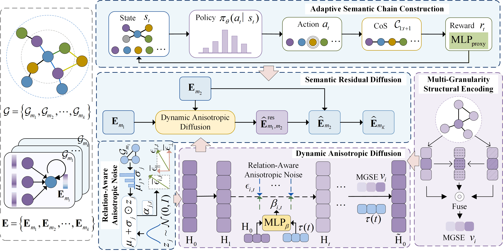
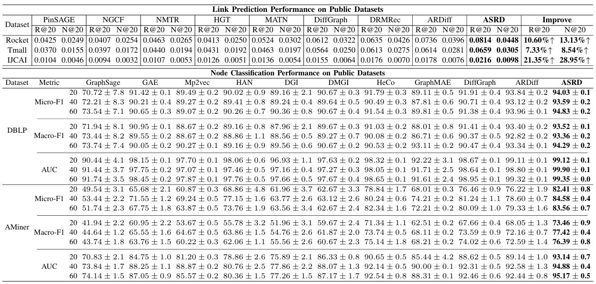

# ASRD: RL-Driven Adaptive Semantic Residual Diffusion for Heterogeneous Graph Learning



## 📝 Environment

We develop our code in the following environment and install all dependencies listed in *requirements.txt*:

- CUDA==12.1

- python==3.9.21

- torch==2.3.1

  

## 📚 Datasets

|    Dataset    |  User  |  Item  |   Link   |       Interactions Types       |
| :-----------: | :----: | :----: | :------: | :----------------------------: |
| Retail Rocket | 2,174  | 30,113 |  97,381  |    View, Cart, Transaction     |
|     Tmall     | 31,882 | 31,232 | 1,451,29 | View, Favorite, Cart, Purchase |
|     IJCAI     | 17,435 | 35,920 | 799,368  | View, Favorite, Cart, Purchase |

|      |     Node      | Metapath |        |      Node       | Metapath |
| :--: | :-----------: | :------: | :----: | :-------------: | :------: |
| DBLP |  Author:4057  |   APA    | AMiner |   Paper:6564    |   PAP    |
|      |  Paper:14328  |  APCPA   |        |  Author:13329   |   PRP    |
|      | Conference:20 |  APTPA   |        | Reference:35890 |   POS    |
|      |   Term:7723   |          |        |                 |          |

## 🚀 How to run the codes

The command lines to train STDE-HGL on the two application domains are as below. The unspecified meters are set as default.

##### Retail Rocket

```python
python main.py --data retail_rocket --noise_scale 5e-2 --steps 250 --gcn_layer 3 --con_dim 16 --k_eigen 6 --margin 0.05 --cl_weight 0.8 --reg 1e-3 --lr 1e-3 --latdim 1024 
```

##### Tmall

```python
python main.py --data tmall --margin 0.5 --latdim 256 --reg 6e-3 --d_emb_size 4 
```

##### IJCAI

```python
python main.py --data ijcai_15 --con_dim 32 --reg 3e-3 --d_emb_size 32 
```

##### DBLP

```python
python main.py --data DBLP --noise_scale 0.1 --sampling_steps 180 --con_dim 32 --k_eigen 8 --cl_weight 0.8 --lr 1e-3  
```

##### Aminer

```python
python main.py --data aminer --gcn_layer 7 --margin 0.05 --cl_weight 0.1 --latdim 256 --lr 1e-4 
```

## 👉 Code Structure

```
.
├──CoS-RL
|   ├── RL.py
|   ├── calculate.py
|   ├── main.py
|   └── params.py
├──NC
|   ├──data
|   │   ├── aminer
|   │   └── DBLP
|   ├── Utils                    
|   │   ├── TimeLogger.py            
|   │   └── Utils.py
|   ├── DataHandler.py
|   ├── main.py
|   ├── Model.py
|   ├── encoder.py
|   └── params.py
├──LP
|   ├──data
|   │   ├── ijcai_15
|   │   ├── retail_rocket
|   │   └── tmall
|   ├── Utils                    
|   │   ├── TimeLogger.py            
|   │   └── Utils.py
|   ├── DataHandler.py
|   ├── main.py
|   ├── Model.py
|   ├── encoder.py
|   └── params.py
├── ASRD.png
├── performance.png
└── README
```

## 🎯 Experimental Results

Overall Performance Comparison on Link Prediction and Node Classification Tasks.



## Acknowledgements

We are particularly grateful to the authors of [ARDiff](https://doi.org/10.1609/aaai.v40i17.38477), as parts of our code implementation were derived from their work. We have cited the relevant references in our paper.
